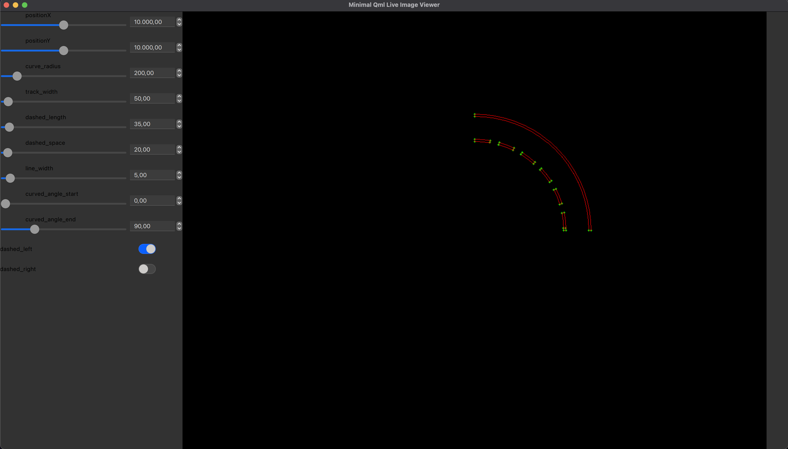

# 

# track_model_curve

QML-based UI for an arc calculator using OpenCV, with arcs drawn via OpenCV's ellipse function.

## Dependencies

The project is based on the following components:

* CMake
* boost
* googletest
* fmt

See [scripts/](https://github.com/Marvin-VW/track_model_curve/tree/main/scripts) for dependency install scripts for multiple distributions.

GoogleTest is pulled in as a git submodule to avoid problems with missing cmake files in sub distributions.

## Usage

Clone, prepare and build with the following steps:

	git clone https://github.com/Marvin-VW/track_model_curve.git
	cd track_model_curve

	git submodule update --init
	
	mkdir build/
	cd build/
	cmake ../
	make
